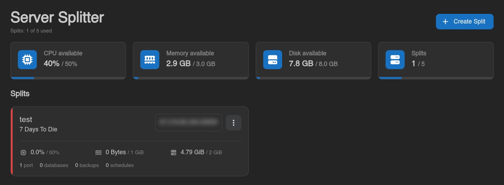
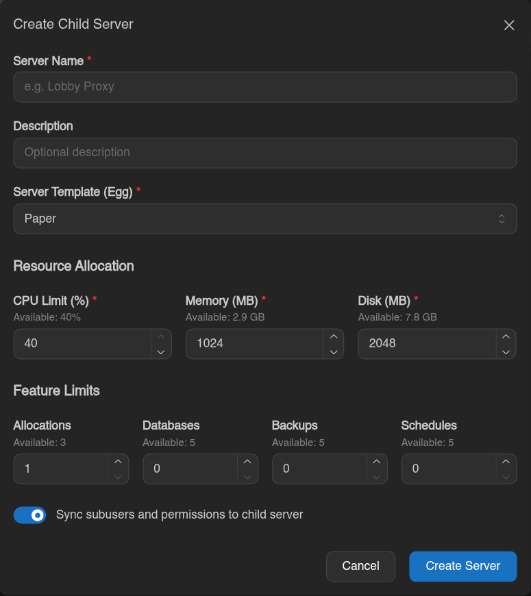
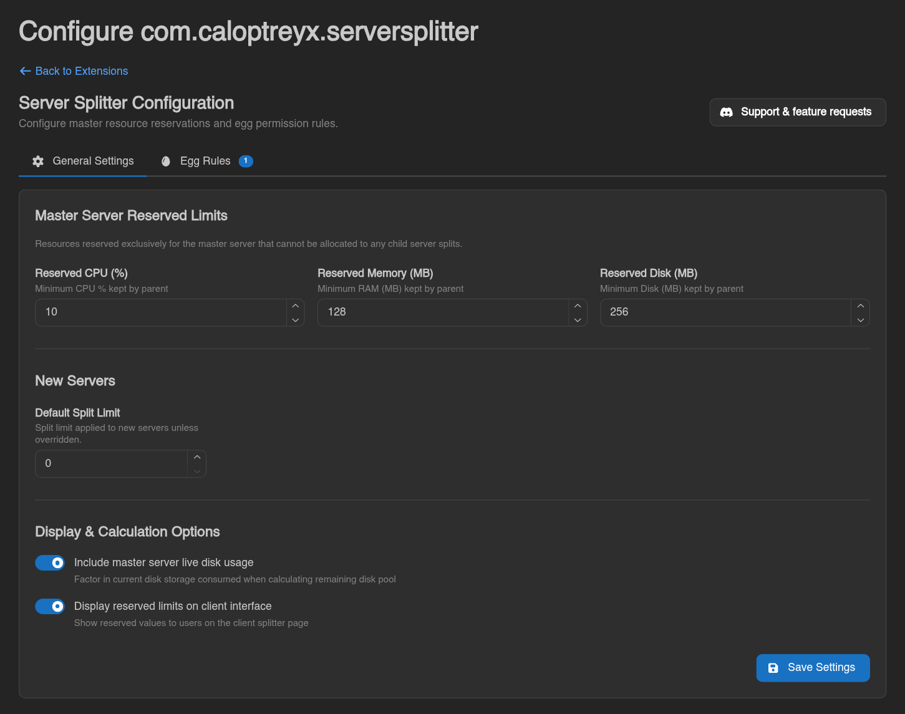
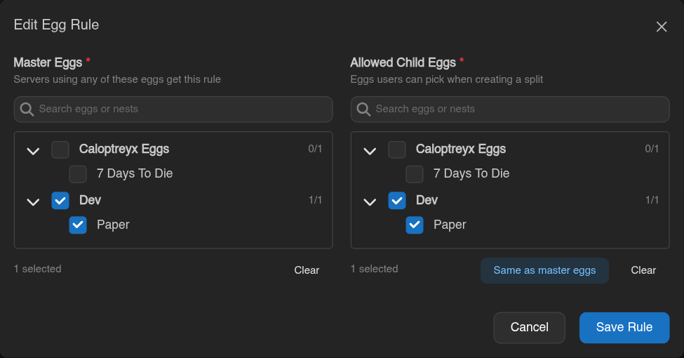
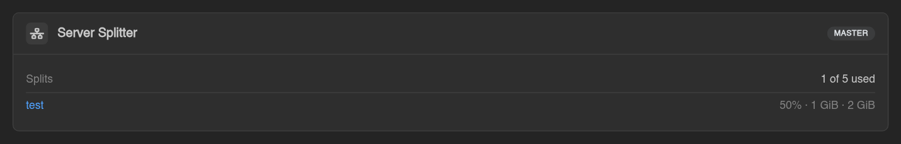
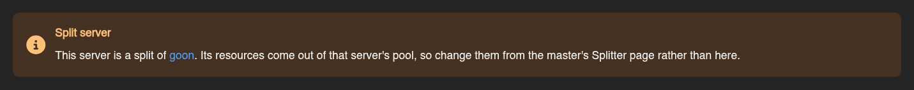

# Server Splitter

A [Calagopus Panel](https://calagopus.com) extension that lets users split a master server's
resources into separate child servers, each with its own console, files, egg and allocation.
Deleting a split gives its resources back to the master.

Package name: `com.caloptreyx.serversplitter` · Requires panel `>=1.2.3`

## What your users get

- A **Splitter** tab on every server showing the master's remaining CPU, memory and disk pool and
  how many of its splits are used.
- **Create splits** by picking a name, an allowed egg, CPU, memory and disk, and allocation,
  database, backup and schedule limits. Every field shows what's still available in the pool.
- The split takes over one of the master's spare allocations as its primary port, or gets a free
  allocation on the master's node (preferring the master's IP) when there is none.
- Optionally copy the master's subusers and their permissions to the new split, and sync them
  again later with **Sync users from master**.
- Split cards with live status, CPU, memory and disk usage and an actions menu to **Resize**,
  **Sync users from master** or **Delete split**. Resizing can't take more than the pool has, and
  can't lower a limit below what the split already uses.
- A split's own Splitter page links back to its master.

## What you get

- **Reserved limits**: CPU, memory and disk every master keeps for itself and can never hand out.
- **Egg rules**: which child eggs may be created from which master eggs, picked from a nest/egg
  tree. A server whose egg matches no rule can't be split.
- **Split limits**: a *Splits Limit* field on the admin server create and update forms
  (`feature_limits.splits`, `0` disables splitting) and a default limit for new servers.
- Option to count the master's live disk usage against its disk pool, and to hide the reserved
  limits from users.
- A **Server Splitter** card on the admin server overview listing a master's splits with their
  limits, or the master of a split, and a notice on every admin page of a split.
- Consistent accounting: every create, resize and delete locks the master and reads its limits
  fresh, the master's new limits are pushed to Wings, and a limited master always keeps at least 1
  CPU/memory/disk (or its reserve, if larger).
- Deleting a master deletes its splits properly first (Wings containers and databases included).
  A split whose master's row disappears anyway becomes a standalone server.

## Installation

Download `com_caloptreyx_serversplitter.c7s.zip` from the
[latest release](https://github.com/Caloptreyx/serversplitter/releases/latest) and either upload it
under **Admin → Extensions** or drop it into your heavy image's `build/extensions/` directory and
`docker compose restart web`. Extensions require the `:heavy` panel image - see the
[Calagopus docs](https://calagopus.com/docs/panel/extensions/installing-extensions).

## Configuration

**Admin → Extensions → Server Splitter → Configure**

1. **General Settings** - reserved CPU (%), memory (MB) and disk (MB) per master, the default split
   limit for new servers, and the display and calculation options.
2. **Egg Rules** - add at least one rule. *Master Eggs* are the eggs the rule applies to, *Allowed
   Child Eggs* are the eggs users may pick when splitting such a server.
3. Give servers a splits limit, either through the default for new servers or per server in the
   admin server's **General** tab under **Feature Limits**. Existing servers start at `0`
   (disabled).

Permissions: server `splitter.read|create|update|delete`, admin `extensions.splitter.read|write`.

## Screenshots

**Create split** - name, egg, resources and feature limits, each bounded by what's left in the
master's pool.

**General Settings** - reserved master limits, default split limit and display options.

**Egg Rules** - which child eggs may be split off which master eggs.

**Admin server overview** - a master's splits with their limits, and the notice on a split's
admin pages.

## API

- `GET|POST /api/client/servers/{server}/splitter`, `GET .../splitter/nests`,
  `PATCH|DELETE .../splitter/{subserver}`, `POST .../splitter/{subserver}/subusers-sync`
- `GET|PUT /api/admin/extensions/com.caloptreyx.serversplitter/settings`
- `POST .../egg-rules`, `PUT|DELETE .../egg-rules/{id}`
- `GET .../servers/{server}` - a server's master or splits

Full schemas are in the panel's OpenAPI document once installed.

## Support

Need help or want to request a feature? Join the [Caloptreyx Discord](https://discord.gg/4qjMWU7S8x).

## License

Released under the MIT License. See [LICENSE](LICENSE).
